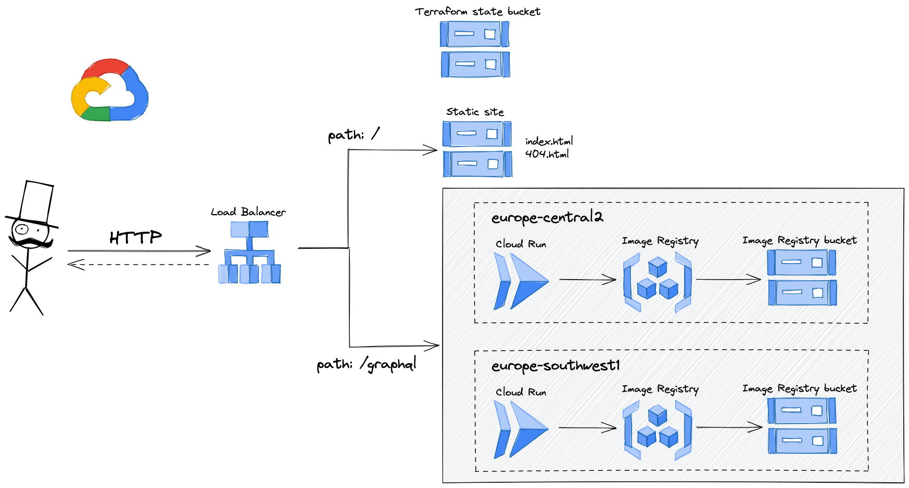
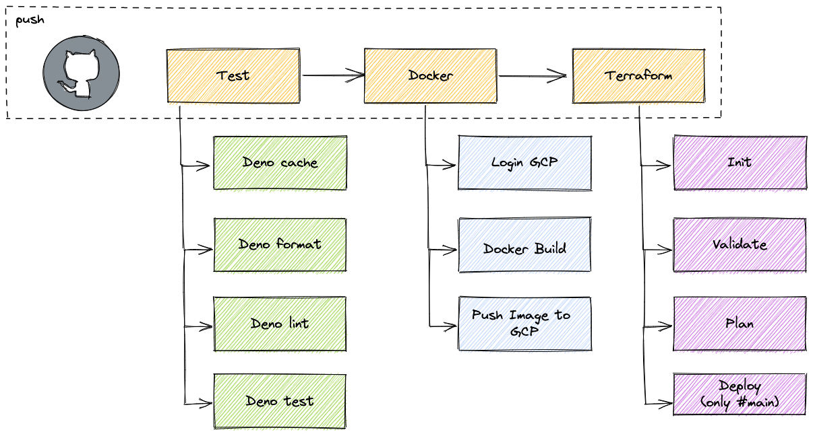

# deno-graphql-gcp


This is a demo of a Deno app to test some technologies:

- `Deno` server exposing a Graphql API.
- Github Actions to run an e2e workflow.
- Terraform to instantiate GCP services.
- Google Cloud Containers.

> Scroll to EOF to see some diagrams.

## Running this app

Clone repository:

```bash
git clone https://github.com/josex2r/deno-graphql-gcp.git
```

Install `Deno` dependencies:

```bash
deno cache deps.ts
```

Run the application in `watch` mode:

```bash
deno run --allow-net --allow-env --watch src/main.ts
```

## Tests

```bash
# Format code
deno fmt

# Run linter
deno lint

# Run tests
deno test --allow-none
```

## GCP diagram



## Github Action Workflow


